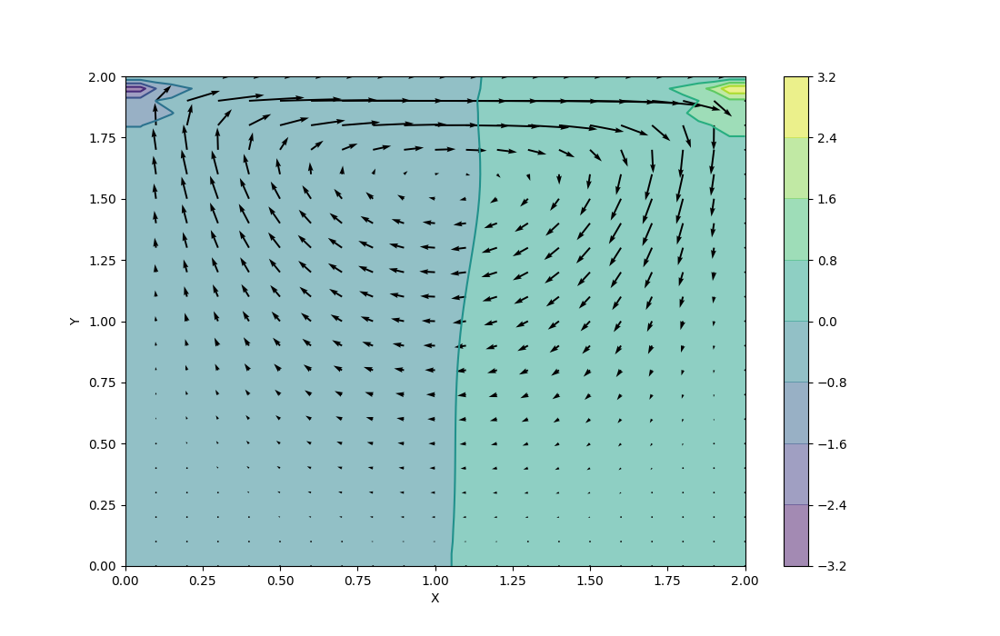

# Final Report

## C++(12_cavity.cpp)

```
g++ -std=c++11 12_cavity.cpp
./a.out
python3 display.py cavity-cpp.json
# you can see cavity-cpp.json.png
```



## CUDA(13_cavity-cuda.cu)

```
nvcc -std=c++11 13_cavity-cuda.cu
./a.out
python3 display.py cavity-cuda.json
# you can see cavity-cuda.json.png
```


